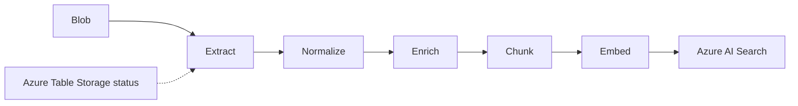

# Amsted AI Tax Agent Ingestion

A clean, local-first pipeline that starts with manually uploaded Azure Blob Storage documents and ends with enriched, embedded chunks in Azure AI Search. It intentionally contains no chatbot, retrieval, orchestration, agent runtime, UI, feedback loop, external source integration, or event-driven infrastructure.

## Architecture



See `docs/architecture.md` and `docs/data_model.md`.

## Layout
- `src/amsted_tax_ingestion`: shared configuration and pipeline stages
- `scripts`: runnable stage tests and index administration
- `tests`: Azure-free unit tests
- `sample_outputs`: local inspection artifacts by stage
- `docs`: architecture and schemas

## Setup

```bash
python -m venv .venv
source .venv/bin/activate  # Windows PowerShell: .venv\Scripts\Activate.ps1
python -m pip install -e ".[dev]"
cp .env.example .env       # Windows: Copy-Item .env.example .env
```

Populate `.env`. Do not commit it. `EMBEDDING_DIMENSIONS` must equal the selected deployment's output dimensions and the search index vector field.

## Commands

```bash
pytest
ruff check .
python scripts/test_extraction.py path/to/sample.pdf
python scripts/test_metadata_enrichment.py sample_outputs/normalized/doc_ID.json
python scripts/test_chunking.py sample_outputs/enriched/doc_ID.json
python scripts/run_pipeline.py --dry-run
python scripts/run_pipeline.py --dry-run --skip-enrichment
python scripts/create_search_index.py
python scripts/delete_search_index.py
python scripts/recreate_search_index.py
python scripts/run_pipeline.py
python scripts/validate_search_index.py
python scripts/validate_search_index.py --document-id doc_ID
```

Extraction tests are local. Metadata enrichment requires Foundry/Azure OpenAI credentials. Pipeline discovery requires Blob credentials. Full execution and index commands require the corresponding live Azure credentials.

## Output folders
`raw`, `extracted`, `normalized`, `enriched`, `chunked`, `embeddings`, and `indexing_logs` are created beneath `sample_outputs`.

## Troubleshooting
- **Missing configuration**: compare `.env` with `.env.example`.
- **Docling/OCR issues**: verify native Docling dependencies supported by your OS and inspect the extracted artifact.
- **Empty email body**: multipart HTML-only EML is not preferred; save as MSG or PDF, or extend `EmlExtractor`.
- **Vector dimension error**: recreate the index only after matching `EMBEDDING_DIMENSIONS` to the deployed embedding model.
- **Search upload failure**: inspect `sample_outputs/indexing_logs`; verify index schema and field sizes.
- **Table error**: verify that the account permits Table Storage and the table name is valid.

## Extension points
Add a new `Extractor`, route its suffix, or replace an Azure client at the stage boundary. Keep scripts thin and preserve local artifacts for repeatable debugging.
