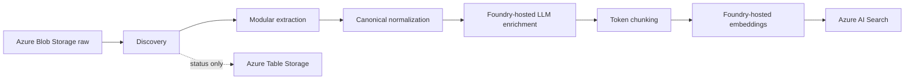

# Architecture

The application is a synchronous, locally executed ingestion worker. Eventing, retrieval, agents, and UI are intentionally excluded. Each stage writes inspectable local artifacts. Azure Table Storage holds status only.

## Decisions
- Package code uses a `src/` layout; scripts are thin entry points.
- Extractors are routed by file suffix. Docling is primary for PDF and Office documents; dedicated parsers handle email and text formats.
- IDs are SHA-256 based and deterministic.
- Azure service clients are isolated in stage modules.
- A failed blob writes an error artifact and does not stop later blobs.
